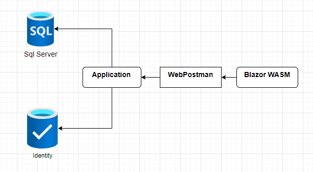

# DoctorAppointmentBooking - FIAP Pós Tech

 
Documentação do SUB DE HACKATON

 #### Especialização em Arquitetura de Sistemas .NET com Azure: SUB DE HACKATON

# 0. Metadados

**Nome do Projeto:** DoctorAppointmentBooking

**Desenvolvedores do Projeto:**

| Aluno                               | RM            |  
| --------------------------------    | ------------- | 
| Rodrigo Castagnaro                  | 349122        |

**Tecnologias Utilizadas:**

| Tecnologia                               | Propósito                                                      |  
| -----------------------------------      | -------------------------------------------------------------- | 
| .NET 8                                   | API, Class Library, Blazor                                     |
| Microsoft SQL Server                     | Banco de Dados                                                 |
| xUnit, Bogus e NSubstitute               | Testes unitários/integrados                                    |
| Visual Studio e VS Code                  | Desenvolvimento                                                |
| GitHub                                   | Versionamento                                                  |
| Miro                                     | Planejamento das demandas do trabalho e desenhos de diagramas  |
| Trello                                   | Kanban das demandas                                            |

# 1. Desafio

O SUB DE HACKATON consiste em desenvolver um projeto para seguinte demanda: Sistema de Agendamento de Consultas Médicas

**Requisitos:**

- Requisitos Funcionais:
    - Os(as) pacientes devem ser capazes de criar e gerenciar contas 
    pessoais.
    - Os(as) pacientes devem ser capazes de agendar, reagendar ou cancelar 
    consultas.
    - Os(as) médicos(as) devem ser capazes de visualizar e gerenciar suas 
    agendas de consultas.
    - Deve haver um sistema de notificação para lembrar pacientes de suas 
    consultas. Estas notificações podem ser via e-mail.
- Requisitos Não Funcionais:
    - o sistema deve ser desenvolvido utilizando C# e .NET.
    - A interface do usuário fica a critério do(a) estudante.
    - O sistema deve ter um fluxo de delete lógico não físico.

# 2. Solução

Primeiramente, definido que iria usar dois bancos de dados separadamente, o Identity e um banco SQL, assim, 2 endpoints: um para gerenciamento das consultas e outro para login na aplicação.
Por fim, foi escolhido a abordagem via container, Docker.

## 2.1. Arquitetura Proposta

Para concretizar as ideias, foi utilizado a abordagem de DDD, de acordo com a seguinte arquitetura:

**Figura 1:** Arquitetura do DoctorAppointmentBooking

De acordo com a Figura 1, a arquitetura do DoctorAppointmentBooking é descrita pelos itens a seguir:

1. Criar as imagens [O Dockerfile para criação da imagem se encontra neste repositório](DockerfileApi).

2. Execução do docker-compose [O docker-compose para criação da imagem se encontra neste repositório](docker-compose).

3. Criação do banco e das tabelas 

4. A API realiza login do usuário ou cadastra um novo usuário no BD de usuários *sql-identity*. Caso a requisição for para um método que usa o BD de Consultas *db-doctorappointment*, a API usa o Identity para autorizar ou não o usuário.

5. O resultado da API é verificado pelo usuário via Swagger ou Postman.

6. O resultado do webapp é verificado pelo usuário via Navegador.

Por fim, apresentamos as entidades criadas, a partir do Migrations e Entity, para persistir as informações de consultas e de usuários. 

**Figura 2:** As entidades criadas

## 2.2. Explicação dos Recursos

A seguir, definimos a função de cada recurso em nossa solução:

- BD SQL: **db-doctorappointment** - o BD em si, contendo as tabelas *DoctorAppointmentBooking*.

- BD SQL: **sql-identity** - o BD em si, contendo as tabelas de usuários do Identity.

## 2.3. Código Desenvolvido

Para elucidar o código desenvolvido, fornecemos as informações a seguir, de cada pasta deste repositório.

Observação: na raiz deste repositório temos os Dockerfiles e a Solution, contendo: um projeto de API, Application, Domain, Infrastructure e BlazorWASM.

**Projeto API (DoctorAppointmentBooking.Presentation.API):**

- Contém os Controllers.

- Os endpoints fornecem as funcionalidades para CRUD da aplicação.

- A API é documentada com o Swagger.

**Projeto BlazorWebApp (DoctorAppointmentBooking.Presentation.BlazorWebApp):**

- Contém as telas de interface com usuário.

**Pasta Infraestrutura: (DoctorAppointmentBooking.Infrastructure)**

- Contém as configurações de BD.

- Mapeamento das tabelas de BD.

- Repository para consultas de BD.
  
- Possui os migrations das entidades para os BDs.

**Pasta Domain: (DoctorAppointmentBooking.Domain)**

- Contém as definições das tabelas de BD.

- Customização de exceptions.

- Interfaces utilizada pelo sistema.  

**Pasta Application: (DoctorAppointmentBooking.Application)**

- Contém as constantes do sistema.

- Models/DTOs.

- Validadores. 

**Pasta res:** recursos usados por este documento.

**Outras pastas:** armazenam informações de configurações das IDEs utilizadas.

## 2.4. Dockefile Criado

Foi criado dois arquivos Dockerfile, necessário para que nossa aplicação rode por meio de um container.

[Dockerfile Api criado](DockerfileApi).
[Dockerfile Blazor WASM criado](DockerfileBlazor).

## 2.5. Docker Compose
Foi criado um arquivo docker-compose, necessário para que se execute a aplição completa.

[Docker-Compose criado](docker-compose).

# 3. Conclusão

Este repositório apresenta uma solução para Agendamento de consutas médicas que usa o .NET com Entity, Identity e tecnologia de containers.

# 4. Referências

1. [ASP.NET Core Blazor](https://learn.microsoft.com/en-us/aspnet/core/blazor/?view=aspnetcore-8.0)

2. [Identity model customization in ASP.NET Core](https://learn.microsoft.com/en-us/aspnet/core/security/authentication/customize-identity-model?view=aspnetcore-8.0)

3. [Docker](https://docs.docker.com/compose/intro/features-uses/)

4. [Introduction to JSON Web Tokens](https://jwt.io/introduction)

 
